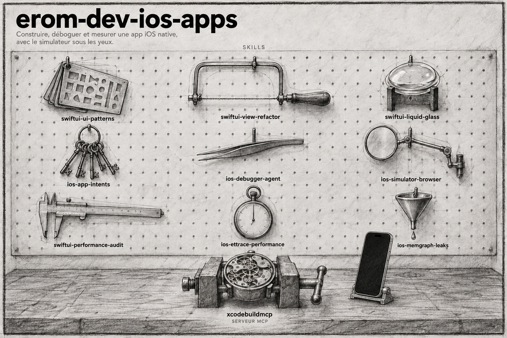

# erom-dev-ios-apps

Plugin Claude Code. Concevoir, déboguer et profiler des apps iOS natives en SwiftUI : App Intents et App Shortcuts, Liquid Glass d'iOS 26, patterns et refactor de vues, audit de performance, traces ETTrace, memgraphs de fuites mémoire, débogage sur simulateur via XcodeBuildMCP et miroir du Simulator dans le navigateur.

## Installation

```
/plugin marketplace add eRom/erom-marketplace
/plugin install erom-dev-ios-apps@erom-marketplace
```

## Les skills

| Skill | Invocation | Ce qu'elle fait |
|---|---|---|
| `ios-app-intents` | `/erom-dev-ios-apps:ios-app-intents` | Concevoir App Intents, App Entities et App Shortcuts pour Siri, Spotlight, Shortcuts et les widgets |
| `ios-debugger-agent` | `/erom-dev-ios-apps:ios-debugger-agent` | Build, run et debug sur Simulator via XcodeBuildMCP : UI, logs, captures |
| `ios-simulator-browser` | `/erom-dev-ios-apps:ios-simulator-browser` | Afficher et piloter le Simulator dans le Browser pane de Claude Code Desktop (ou Chrome), previews SwiftUI en hot reload |
| `ios-ettrace-performance` | `/erom-dev-ios-apps:ios-ettrace-performance` | Capturer et lire des profils ETTrace symbolicated sur un flow précis |
| `ios-memgraph-leaks` | `/erom-dev-ios-apps:ios-memgraph-leaks` | Capturer et comparer des memgraphs pour trouver la root cause d'un leak |
| `swiftui-liquid-glass` | `/erom-dev-ios-apps:swiftui-liquid-glass` | Adopter ou revoir les API Liquid Glass d'iOS 26+ |
| `swiftui-performance-audit` | `/erom-dev-ios-apps:swiftui-performance-audit` | Auditer la performance SwiftUI depuis le code, puis guider le profiling |
| `swiftui-ui-patterns` | `/erom-dev-ios-apps:swiftui-ui-patterns` | Construire l'UI SwiftUI avec des patterns éprouvés : navigation, sheets, listes, formulaires |
| `swiftui-view-refactor` | `/erom-dev-ios-apps:swiftui-view-refactor` | Découper les grosses views SwiftUI en compositions plus petites et stables |

Serveur MCP embarqué : XcodeBuildMCP 2.7.0, lancé via `bunx`.

## Origine

Les skills sont portées depuis le plugin `build-ios-apps` d'OpenAI
([github.com/openai/plugins](https://github.com/openai/plugins), licence MIT),
traduites en français et adaptées à Claude Code.

## Licence

MIT, Romain Ecarnot.
