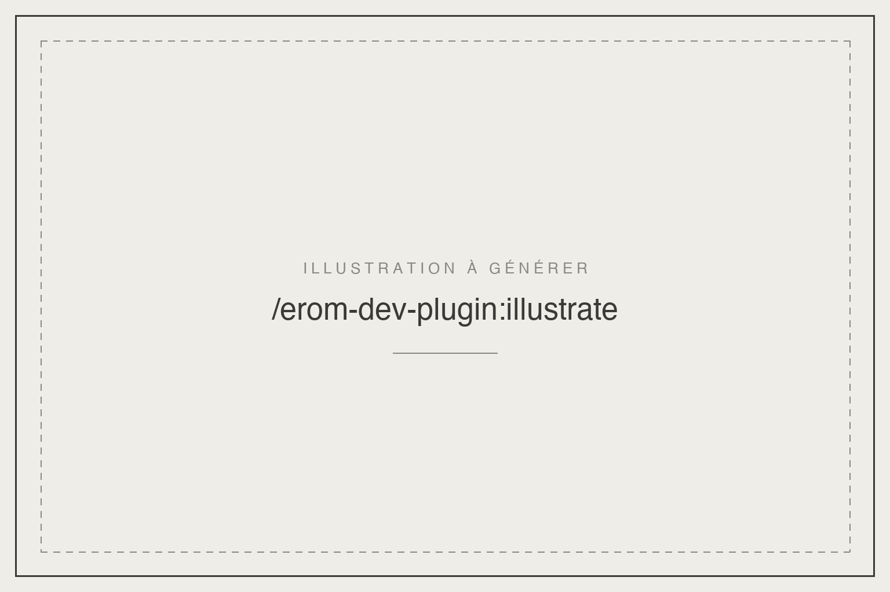

# erom-dev-ios-apps

Plugin Claude Code. Concevoir, déboguer et profiler des apps iOS natives en SwiftUI : App Intents et App Shortcuts, Liquid Glass d'iOS 26, patterns et refactor de vues, audit de performance, traces ETTrace, memgraphs de fuites mémoire, débogage sur simulateur via XcodeBuildMCP et miroir du Simulator dans le navigateur.

## Installation

```
/plugin marketplace add eRom/erom-marketplace
/plugin install erom-dev-ios-apps@erom-marketplace
```

## Les skills

| Skill | Invocation | Ce qu'elle fait |
|---|---|---|
| | | |

## Licence

MIT, Romain Ecarnot.
